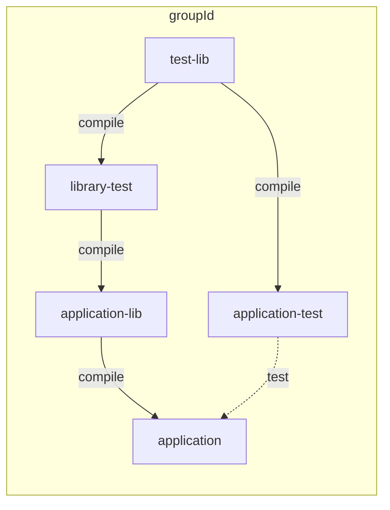

# transitive-scope-confusion

This project illustrates a confusing output from `mvn dependency:tree`.

Consider the following minimal example:

 * `test-lib`: provides support for testing, e.g.: junit, testng, etc
 * `library-test`: building on `test-lib`, with specialisations for testing library projects
 * `application-test`: building on `test-lib`, with specialisations for testing application projects
 * `application-lib`: supports the implementation of `application`, uses `library-test` for its test suite
 * `application`: the final distributable project. Uses `application-lib` to support functionality, uses `application-test` for its test suite.

We notice that `test-lib` classes are  showing up in the `application` artifact, but `mvn dependency:tree` shows:

```
[INFO]
[INFO] ------------------------< groupId:application >-------------------------
[INFO] Building application 0.0.1-SNAPSHOT                                [5/7]
[INFO] --------------------------------[ jar ]---------------------------------
[INFO]
[INFO] --- maven-dependency-plugin:2.8:tree (default-cli) @ application ---
[INFO] groupId:application:jar:0.0.1-SNAPSHOT
[INFO] +- groupId:application-lib:jar:0.0.1-SNAPSHOT:compile
[INFO] |  \- groupId:library-test:jar:0.0.1-SNAPSHOT:compile
[INFO] \- groupId:application-test:jar:0.0.1-SNAPSHOT:test
[INFO]    \- groupId:test-lib:jar:0.0.1-SNAPSHOT:compile
[INFO]
```

`test-lib` _is_ displayed as having `compile` scope, but it's shown as a child of `application-test`, which has `test` scope.

This is a confusing result, as [the `compile`-scoped transitive dependencies of a `test`-scoped dependency should also be included with a scope of `test`](https://maven.apache.org/guides/introduction/introduction-to-dependency-mechanism.html#dependency-scope).

Further, if we investigate the [`application`](application/pom.xml) and [`application-test`](application-test/pom.xml) poms we find no problems:
 * the dependency in `application` on `application-test` has scope `test`
 * the dependency in `application-test` on `test-lib` has scope `compile`.

This should result in `test-lib` being included with scope `test` in `application`.

Taking a more complete look at the dependency graph reveals the _actual_ issue:

<!-- start_module_diagram:deps -->



<!-- end_module_diagram -->

`application-lib` has mistakenly included `application-test` with `compile` scope, providing the route for test-lib classes to end up in our `application` artifact.

# tl;dr

If `mvn dependency:tree` shows you a `test`-scoped dependency with `compile`-scoped children, the root cause exists somewhere else entirely in your dependency graph and the standard output of `dependency:tree` will not help you to find it.
